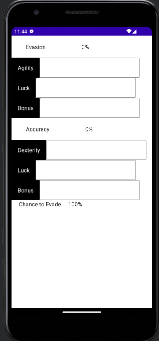

# AndroidHitRateCalc
An EXTREMELY basic translation of my iOS app. Jetpack Compose is declaritive like SwiftUI, so I used ChatGPT to help translate some of the code from Swift to Kotlin. Full disclosure, I didn't put much effort into this but maybe someone else can spruce up the design?

## Architecture
What architecture? Everything is in a single file. Not there's much code to begin with.

## Disclaimer
HitRateCalc is not affiliated with or endorsed by Square Enix or gumi Inc. Final Fantasy Brave Exvius: War of the Visions is a registered trademark of Square Enix.

## Contributions
Any contributions from the community is certainly welcome (and direly needed). If you have any features or bug fixes to suggest, please submit a pull request.

## Screenshot

   

## License
AndroidHitRateCalc is licensed under the MIT License.
